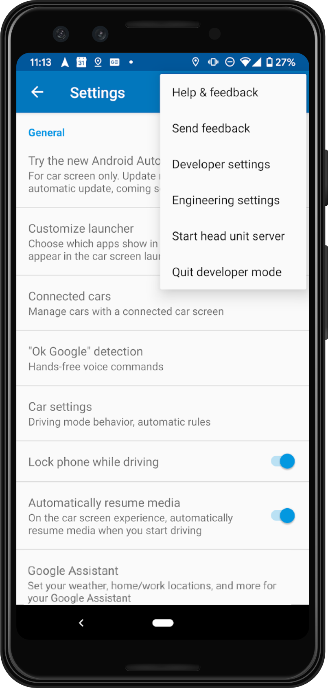

A tutorial is  available on https://youtu.be/VUYU2uIRq60

- Install Android Studio

- Set mobile to development mode and Android Auto to develoment mode (tap 10 times on version)

- Add tools: Settings->Appearance&Behavior->System Setting->Android SDK->SDK tools
    - Android Auto Desktop Head Unit Emulator
    - Android SDK Platform-Tools

- Create new empty Android Auto project

- Add Java version 1.8 and Android Auto dependency to ```build.gradle``` (https://developer.android.com/jetpack/androidx/releases/car-app#declaring_dependencies):
```gradle
android {
    ...
    compileOptions {
        targetCompatibility = JavaVersion.VERSION_1_8
        sourceCompatibility = JavaVersion.VERSION_1_8
    }
    ...
}
...
dependencies {
    implementation "androidx.car.app:app:1.0.0-beta01"
    ...
}
```

- Add service to AndroidManifest.xml:
```xml
        ...
        <meta-data
            android:name="com.google.android.gms.car.application"
            android:resource="@xml/automotive_app_desc"/>
        <service
            android:name=".HelloWorldService"
            android:exported="true">
            <intent-filter>
                <action android:name="androidx.car.app.CarAppService" />
            </intent-filter>
        </service>
```

- Create folder xml in res and add file automotive_app_desc.xml:
```xml
<?xml version="1.0" encoding="utf-8"?>
<automotiveApp>
<uses name="template" />
</automotiveApp>
```

- Create new java class HelloWorldService of Superclass CarAppService (https://developer.android.com/training/cars/navigation#create-carappservice):
```java
package com.example.aahello;

import android.content.Intent;
import androidx.annotation.NonNull;
import androidx.car.app.CarAppService;
import androidx.car.app.Screen;
import androidx.car.app.Session;
import androidx.car.app.validation.HostValidator;

public class HelloWorldService extends CarAppService {
    @NonNull
    @Override
    public HostValidator createHostValidator() {
        return HostValidator.ALLOW_ALL_HOSTS_VALIDATOR;
    }

    public Session onCreateSession() {
        return new Session() {
            @NonNull
            @Override
            public Screen onCreateScreen(@NonNull Intent intent) {
                return new HelloWorldScreen(getCarContext());
            }
        };
    }
}
```
- Create new java class HelloWorldScreen of Superclass Screen (https://developer.android.com/training/cars/navigation#create-start-screen):
```java
package com.example.aahello;

import androidx.annotation.NonNull;
import androidx.car.app.CarContext;
import androidx.car.app.Screen;
import androidx.car.app.model.Pane;
import androidx.car.app.model.PaneTemplate;
import androidx.car.app.model.Row;
import androidx.car.app.model.Template;

public class HelloWorldScreen extends Screen {
    public HelloWorldScreen(CarContext carContext) {
        super(carContext);
    }
    @NonNull
    @Override
    public Template onGetTemplate() {
        Row row = new Row.Builder().setTitle("Hello AA World!").addText("Example text").build();

        return new PaneTemplate.Builder(new Pane.Builder().addRow(row).build()).setTitle("AA Hello!!!").build();
    }
}

```

- Plug in your mobile to your development computer with a USB cable

- Start the Android Auto head unit server:



- Start the desktop head unit:
```cmd
<SDK_LOCATION>\platform-tools\adb forward tcp:5277 tcp:5277
<SDK_LOCATION>\extras\google\auto\desktop-head-unit.exe
```